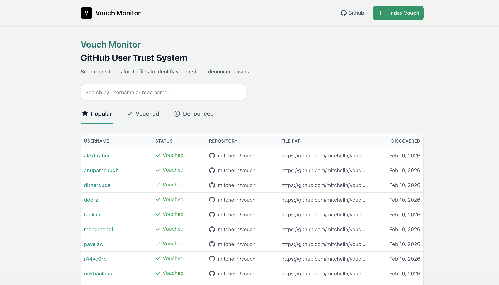

# Vouch Monitor

A GitHub user trust monitoring system based on explicit vouch/denounce declarations from .td files.



## API

### Index a .td File

**POST** `/api/index-repo`

```json
{
  "fileUrl": "https://github.com/owner/repo/blob/main/VOUCHED.td"
}
```

**Response:**
```json
{
  "success": true,
  "users": [...],
  "newCount": 10
}
```

### Get All Users

**GET** `/api/index-repo`

Query parameters:
- `username` - Filter by username
- `repo` - Filter by repository

**Examples:**
```
GET /api/index-repo
GET /api/index-repo?username=john_doe
GET /api/index-repo?repo=owner/repo
GET /api/index-repo?username=john_doe&repo=owner/repo
```

**Response:**
```json
{
  "success": true,
  "users": [
    {
      "username": "john_doe",
      "status": "vouch",
      "repo": "owner/repo",
      "filePath": "...",
      "addedAt": "2026-02-10T...",
      "platform": "github"
    }
  ],
  "count": 10
}
```

## License

MIT

---

Built by [@onurkanbakirci](https://github.com/onurkanbakirci)
